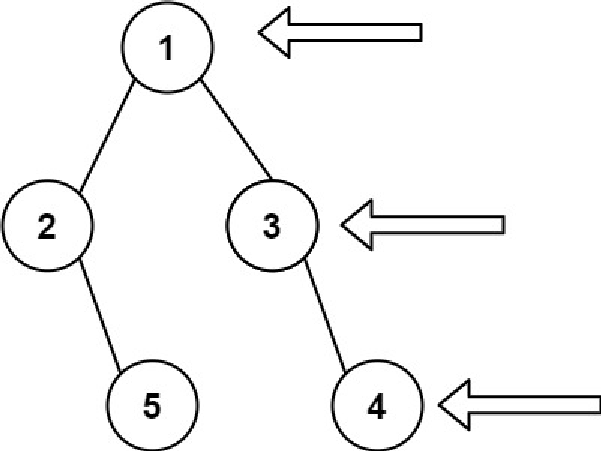

:doctitle: Title
:author: Jerod Gawne
:email: jerodg@pm.me
:docdate: 04 January 2024
:revdate: {docdatetime}
:doctype: article
:sectanchors:
:sectlinks:
:sectnums:
:toc:
:keywords:

== Problem
[.lead]
Given the `root` of a binary tree, imagine yourself standing on the *right side* of it, return _the values of the nodes you can see ordered from top to bottom_.

*Example 1:*

....
Input: root = [1,2,3,null,5,null,4]
Output: [1,3,4]
....

*Example 2:*

....
Input: root = [1,null,3]
Output: [1,3]
....

*Example 3:*

....
Input: root = []
Output: []
....

=== Constraints
* The number of nodes in the tree is in the range `+[0, 100]+`.
* `+-100 <= Node.val <= 100+`

== Examples
=== Example 0

=== Example 1

=== Example 2

== Follow-up

== Related Topics
Tree

Depth-First Search

Breadth-First Search

Binary Tree
