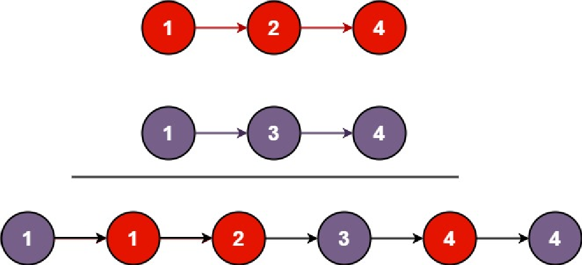

:doctitle: Merge Two Sorted Lists
:author: Jerod Gawne
:email: jerodg@pm.me
:docdate: 04 January 2024
:revdate: {docdatetime}
:doctype: article
:sectanchors:
:sectlinks:
:sectnums:
:toc:
:icons: font
:keywords: problem, python, merge, sort, list

== Problem
[.lead]
You are given the heads of two sorted linked lists `list1` and `list2`.

Merge the two lists into one *sorted* list. The list should be made by splicing together the nodes of the first two lists.

Return _the head of the merged linked list_.

=== Constraints
* The number of nodes in both lists is in the range `[0, 50]`.
* `-100 <= Node.val <= 100`
* Both `list1` and `list2` are sorted in *non-decreasing* order.

== Examples
=== Example 0

----
Input: list1 = [1,2,4], list2 = [1,3,4]
Output: [1,1,2,3,4,4]
----

=== Example 1
----
Input: list1 = [], list2 = []
Output: []
----

=== Example 2
----
Input: list1 = [], list2 = [0]
Output: [0]
----

== Follow-up

== Related Topics
Linked List

Recursion
